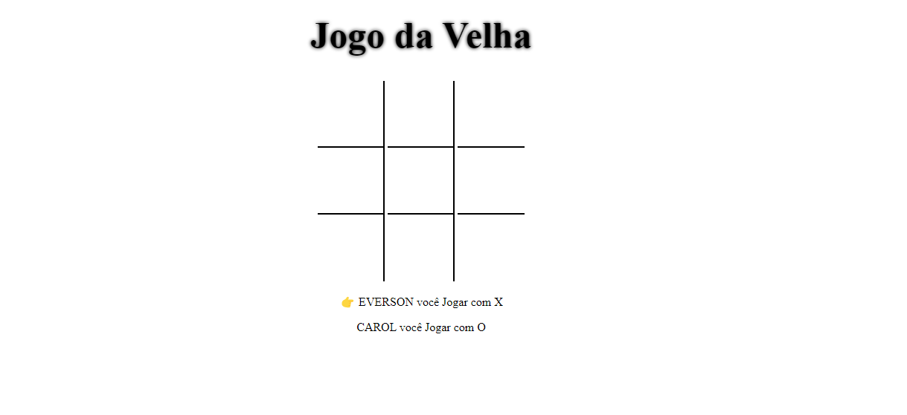
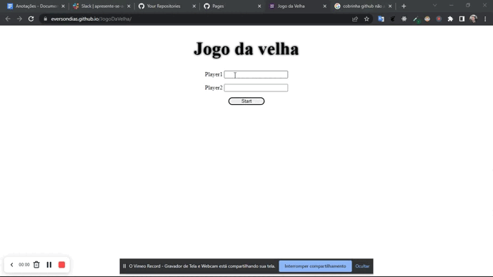

# Jogo Da Velha




# Tecnologias utilizadas


# Índice

* [Título](#jogo-da-velha)
* [tecnologias utilizadas](#tecnologias-utilizadas)
* [Índice](#índice)
* [Descrição do projeto](#descrição-do-projeto)
* [Status do Projeto](#status-do-projeto)
* [Funcionalidade do projeto](#🔨-funcionalidade-do-projeto)
* [Acesso ao Projeto](#acesso-ao-projeto)

# Descrição do Projeto

O Famoso jogo da velha onde duas pessoal podem jogar, na primeira tela você pode escolher um nome para o player 1 e player 2 ou deixa o nome default, na tela do jogo na parte inferior tem um placar que mostra de quem é a vez, ao fim do jogo pode escolher jogar novamente com os mesmo nomes ou finalizar que retorna para a primeira tela.



# Status do Projeto

> 💹 Alpha 💹

# 🔨 Funcionalidade do projeto

- É possível renomeá o player 1 e 2
- É possível jogar com nome default
- Tem um placar que mostra de quem é a vez
- Tem um alerta que fala quem ganhou ou avisa o empate
- É possível reiniciar o jogo com os mesmo jogadores

# Acesso ao projeto
você precisa ter Instalado o npm e o nodejs.

1° Clone o Projeto

```bash
git clone git@github.com:EversonDias/JogoDaVelha.git
```

2° Entre no projeto

```bash
cd JogoDaVelha
```

3° inicie o projeto

```bash
npx live-server
```
você tera uma resposta parecida com isso

```bash
Serving "/home/my-user/my-projects/MultLinks" at http://127.0.0.1:8080
Ready for changes
```

a aplicação estará aberta nesta rota

```bash
http://127.0.0.1:8080
```

ou acesse através do link

* [Jogo da Velha](https://eversondias.github.io/JogoDaVelha/)
